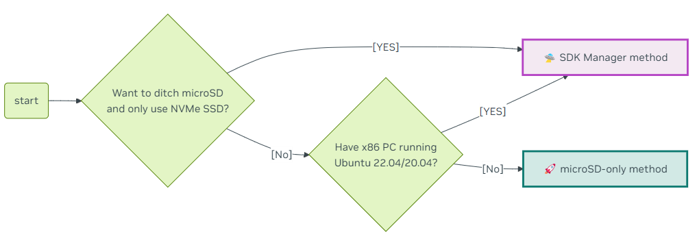
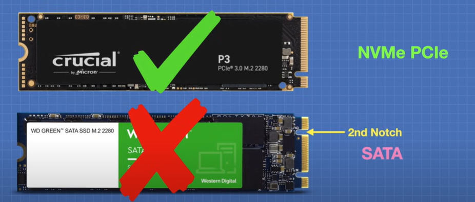
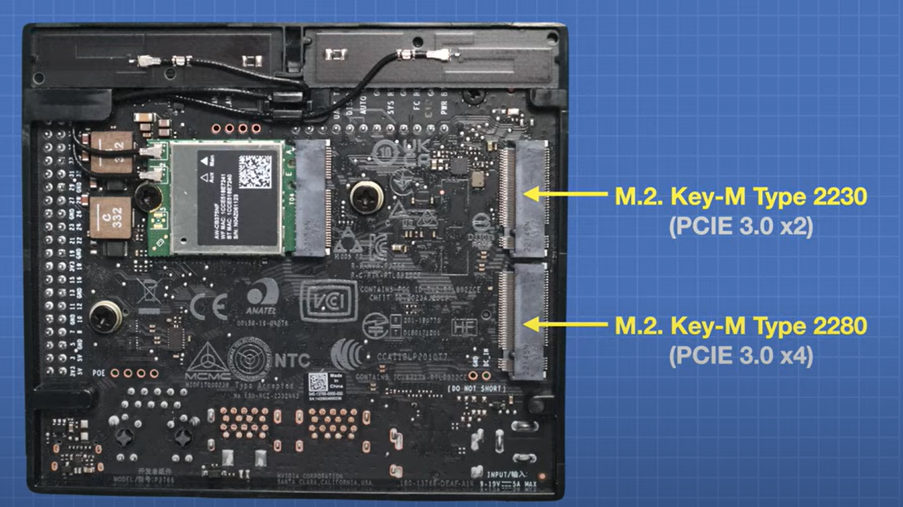
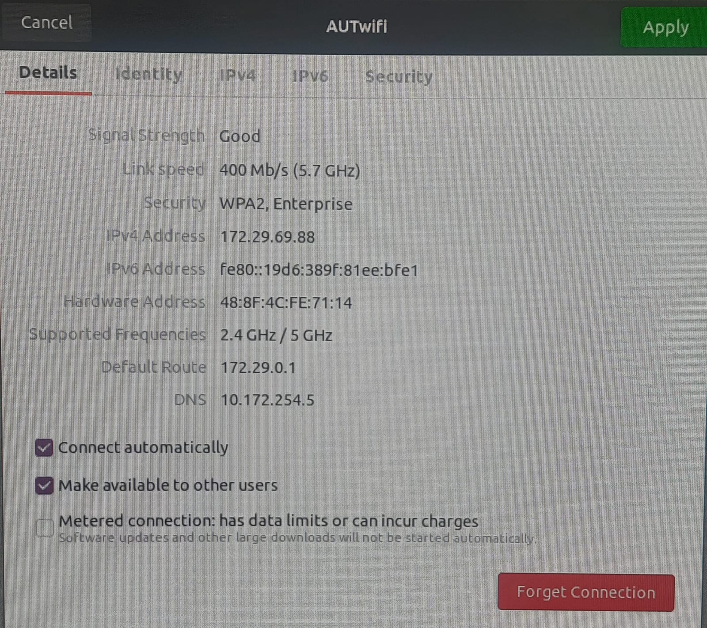
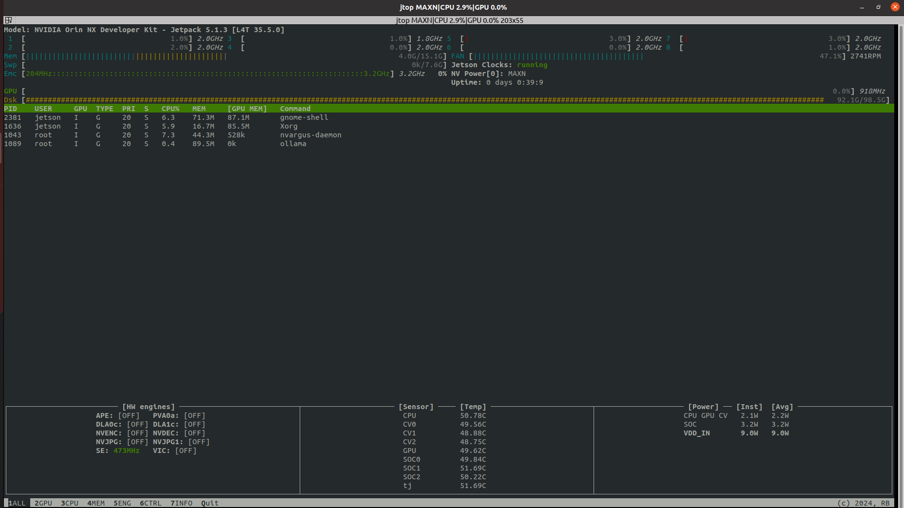
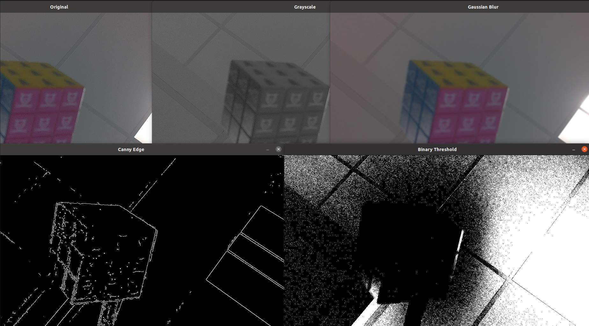
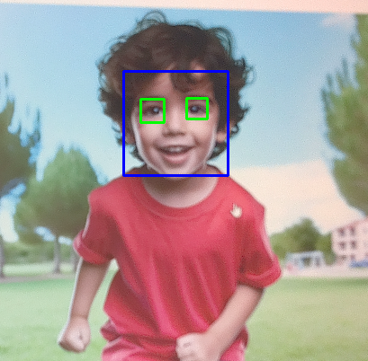

# Jetson

## WEBSITE:
https://www.jetson-ai-lab.com/  
**https://www.jetson-ai-lab.com/initial_setup_jon.html**  

## INTRODUCTION:

- Kit to start your journey of local generative AI evaluation and development  

### APPLICATIONS:
#### LLM (Large Language Models):
- Software that understands text and languages
- Generates human-like responses
- Examples: ChatGPT, Copilot, Gemini


#### VLM (Visual Language Models):
- Software that understands text and images
- Used for image captioning and text-to-image generation

#### ViTs (Vision Transformers):
- Image recognition neural networks
- Image classification and detection
- Used in self-driving cars and medical imaging

### STORAGE:
- NVMe SSD is used for the OS and data. **SDK Manager** is required to flash the latest JetPack on the NVMe SSD.
- If you have an x86 PC running Ubuntu 22.04 or 20.04, you can flash your Jetson Orin Nano Developer Kit with the latest firmware and JetPack using **NVIDIA SDK Manager**.



Since we have an NVMe SSD, we need **NVIDIA SDK Manager**.

[Watch Video](https://www.youtube.com/watch?v=FX2exKW_20E)

#### SSD (Solid State Drives):
- SDK MANAGER is required to boot JetPack
- Ubuntu 20.04 or 22.04 is required to use SDK Manager

#### SDK Manager Download:
- [YouTube Video](https://www.youtube.com/watch?v=BaRdpSXU6EM&t=418s) (22:52, 29:49)
- [SDK Manager Method](https://www.jetson-ai-lab.com/initial_setup_jon_sdkm.html#overall-flow-sdk-manager-method)

### JetsonZoo:
A collection of tutorials and links for downloading Python libraries.

### Advantages of SSD over microSD:
- Faster
- Larger capacity
- Cheaper
- More reliable



### Types of SSD:
1. **NVMe** - Supported
2. **SATA** - Not Supported



### SDK Manager:
NVIDIA SDK Manager is a one-stop solution that helps set up all the software required to work with NVIDIA hardware (Jetson Orin, GPUs, etc.).

Imagine you're building a gaming PC. Instead of searching for each driver, tool, or setting manually, you use a single program that installs everything in one go. That’s what the SDK Manager does for developers—it downloads, installs, and sets up the required software and tools automatically.

- Saves time
- Reduces errors
- Ensures proper configuration for development on NVIDIA platforms

### PACKING LIST:
- Jetson Orin NX core module
- Cooling fan
- Network card antenna
- Jetson Orin NX expansion board
- Power supply

## SETUP:

### CASING:
1. [Jetson Board Setup](https://www.youtube.com/watch?v=zxMn6U1DauE)
2. [Camera Setup](https://www.youtube.com/watch?v=fliiLNNoIWM)
3. [Antenna Setup](https://www.youtube.com/watch?v=tTHzI6u2lmE)

### CONNECTION STEPS:
1. Attach the antenna and camera.
2. Disconnect the HDMI cable from the CPU and connect it to the Jetson.
3. Disconnect the keyboard and mouse from the CPU and connect them to the Jetson.
5. Connect the power supply.
6. Connect to the wifi




7. Check Ubuntu version:  
```bash  
lsb_release -a  
```

#### JETPACK:

I was not able to install SDK manger on my device as the Jetson Orin NX is an ARM64 (aarch64) architecture device, while the SDK Manager package you downloaded is likely built for AMD64 (x86_64), which is meant for standard PCs. The SDK Manager cannot be installed directly on Jetson Orin NX because it is designed to run on a separate host PC (typically an Ubuntu x86_64 machine) for flashing and development.

I have directly installed Jetpack:

```bash  
sudo apt update
sudo apt upgrade -y
sudo apt install nvidia-jetpack
```
This will install:
  
1. CUDA
2. TensorRT
3. cuDNN
4. OpenCV
5. Multimedia API
6. VPI (Vision Programming Interface)

Verify the installation:
- Check if CUDA is installed properly:
```bash  
nvcc --version
```
- Check the installed JetPack version:
```bash  
dpkg -l | grep nvidia-jetpack
```

#### CAMERA

1. **Power Off the Jetson Device**
   - Before connecting the camera, make sure the Jetson device is powered off.

2. **Identify the CSI Port**
   - Locate the CSI (Camera Serial Interface) port on your Jetson device.
   - The CSI port is a small, thin slot labeled `CAM0` or `CAM1`.

3. **Insert the Golden Ribbon Cable**
   - Make sure the cable is in the correct orientation:
     - The **golden contacts** should face **down** (towards the board).
     - The **blue side** should face **up**.
   - Carefully insert one end of the ribbon cable into the CSI port on the Jetson.
   - Lock the connector by gently pressing down the black plastic clip.

4. **Connect the Camera Module**
   - Insert the other end of the golden ribbon cable into the camera module’s connector.
   - Ensure the golden contacts face **down** towards the circuit board.
   - Lock the connector by pressing the black clip.

5. **Power On the Jetson Device**
   - Once the camera is securely connected, turn on the Jetson device.

6. **Verify Camera Detection**
   - Open a terminal and run the following command:
     ```bash
     ls /dev/video*
     ```
     If the camera is detected, you should see a device like `/dev/video0`.

     
Code to start video:
```bash
git clone https://github.com/jetsonhacks/CSI-Camera
cd /CSI-Camera
python3 simple_camera.py

  ```


# PoseNet Installation on Jetson Nano (Micro USB Version) ([System Crashed](#system-crashed) when performed this as entire memory space was occupied)


## OS: JetPack 4.6

### 1. Enable Temperature Control (if a fan is connected)
```sh
sudo apt install python3-dev
git clone https://github.com/Pyrestone/jetson-fan-ctl.git
cd jetson-fan-ctl
./install.sh
```

### 2. Monitor Jetson Nano (RAM, CPU, GPU, and other parameters)
```sh
jtop
```





**Top Section - System Overview**  
**Model:** NVIDIA Orin NX Developer Kit  
**JetPack Version:** 5.1.3 (L4T 35.5.0)  
**CPU Usage:** Displays [CPU Usage](#cpu-usage) for all cores with [Clock Speeds](#clock-speeds) (e.g., 2.0GHz).  
**Memory Usage:** Shows total and used RAM [Memory Usage](#memory-usage)  
**Swap Usage:** Displays swap memory usage[Swap Usage](#swap-image)  
**Fan Speed:** 47.1% running at 2741 RPM.  
**Jetson Clocks:** running (indicates maximum performance mode is enabled). 
**EMC:** The current EMC frequency is 204 MHz, while the maximum it can reach is 3.2 GHz [EMC](#emc)
**Power Mode:** MAXN (maximum power mode).  
**Uptime:** 0 days 0:39:9 (device has been running for about 39 minutes).  

**Middle Section - Process Table**
Shows active processes using CPU/GPU:  
**gnome-shell:** Uses 71.3MB RAM and 87.1MB GPU RAM [GNOME-Shell & Xorg](#gnome-shell-&-xorg)  
**Xorg:** Uses 16.7MB RAM and 85.5MB GPU RAM (handles graphical display) [GNOME-Shell & Xorg](#gnome-shell-&-xorg)  
**nvargus-daemon:** Camera-related process.  
**ollama:** AI-related process.  

**Bottom Section - Hardware & Sensors**  
**[HW engines]:** Shows status of hardware accelerators like:  
DLA (Deep Learning Accelerator): Off  
NVENC/NVDEC (Video Encoding/Decoding): Off  
VIC (Vision Image Processor): Off  
**SE (Security Engine):** Running at 473 MHz  
**[Sensor Temperatures]:**
CPU: 50.78°C  
GPU: 49.62°C   
SOC (System on Chip): ~ 50°C  
TJ (Junction Temperature): 51.69°C  
**[Power Usage]:**
CPU/GPU: 2.1W  
SOC: 3.2W  
Total Power Consumption (VDD_IN): 9.0W  

### 3. Install Required Dependencies
```sh
sudo apt-get install git cmake python3-dev libhdf5-serial-dev hdf5-tools libatlas-base-dev gfortran
```

### 4. Install Pip for Python 3
```sh
sudo apt install python3-pip
sudo -H pip3 install -U jetson-stats
```

### 5. Jetson Inference Setup
#### 5.1 Update System and Install Tools
```sh
sudo apt-get update
sudo apt-get install git cmake
```

#### 5.2 Clone the Repository
```sh
git clone https://github.com/dusty-nv/jetson-inference
cd jetson-inference
git submodule update --init
```

### 6. Install Additional Libraries
```sh
sudo apt-get install libpython3-dev python3-numpy
```

### 7. CMake Configuration
```sh
mkdir build
cd build
cmake ../
```

### 8. Download Models
```sh
cd jetson-inference/tools
./download-models.sh
```

### 9. Install PyTorch
#### 9.1 Execute Installation
```sh
cd jetson-inference/build
./install-pytorch.sh
```

#### 9.2 Verify Installation
```sh
make -j8
sudo make install
sudo ldconfig
```

### 10. Run a Model
```sh
cd
cd jetson-fan-ctl/jetson-inference/build/aarch64/bin
#cd /home/ialab/jetson-inference/build/aarch64/bin
python3 "model_name_to_run"
```

### 11. View Development Board Statistics
```sh
jtop
```

## Optional: Increase RAM via Swap
### 1. Disable `nvzramconfig`
```sh
sudo systemctl disable nvzramconfig
```

### 2. Create a 4GB Swap File
```sh
sudo fallocate -l 4g /mnt/4g.swap
sudo mkswap /mnt/4g.swap
sudo swapon /mnt/4g.swap
```

### 3. Add Swap to fstab
```sh
sudo gedit /etc/fstab
```

Add the following line at the end of the file:
```sh
/mnt/4g.swap none swap sw 0 0
```

Check Camera Functionality
Run the following command:
```sh
gst-launch-1.0 nvarguscamerasrc ! nvoverlaysink
```
To close the window, press Ctrl + C.
This guide provides step-by-step instructions to set up and run PoseNet on the Jetson Nano. Ensure
all dependencies are installed properly before running models.
```sh
sudo swapon /mnt/4g.swap
```

### 3. Make Swap Permanent
```sh
sudo gedit /etc/fstab
```
Add this line at the end of the file:
```
/mnt/4g.swap   none    swap    sw      0       0
```

## Check Camera Functionality
```sh
gst-launch-1.0 nvarguscamerasrc ! nvvidconv ! videoconvert ! xvimagesink
```
Press `Ctrl + C` to close the window.

## COMANDS ON LINUX:
1. Make Folder
```sh
mkdir <folder_name>
```
2. Delete Folder
```sh
rm -rf <folder_name>
```
3. Change directory
```sh
cd <folder_name>
```
4. List files in the directory
```sh
ls
```
5. Crete file
```sh
touch <file_name>
```
6. Open file for editing
```sh
vim <file_name>
```

In vim, press i to start editing, type your content, then press ESC to exit insert mode. To save and quit, type :wq and press Enter.


## IMAE PROCESSING ALGORITHMS
Approaches:
1. Sliding window object deetction
2. Region-based Convolutional Neural Network (R CNN)
3. Fast R CNN
4. Faster R CNN
5. Yolo (You only look once)


```sh
git clone https://github.com/Brinnel/Jetson.git
cd Jetson
```

### Python Code to Capture and pre process the video frame
Install OpenCV
```sh
sudo apt-get install python3-opencv
```

```sh
python3 pre_process.py
```




### Python Code to Capture Face and eyes in the video frame using Haar cascades (Sliding window object deetction)

```sh
python3 Haar_face_detecton.py
```



The code uses the `cv2.VideoCapture` function to capture video from the camera and apply Haar Cascade classifiers for face and eye detection. It then displays the video stream with detected faces and eyes highlighted by rectangles.

### Python Code to Capture Face and eyes in the video frame using Yolo:


#### Code Explanation

**Haar Cascades: Pre-trained Models**
- Haar cascades are pre-trained models for detecting objects such as faces and eyes.
- The classifiers used in this project are:
  - **Face detection**: `haarcascade_frontalface_default.xml`
  - **Eye detection**: `haarcascade_eye.xml`

**Read Frame from the Camera**
```sh
While True:
  ret, frame = video_capture.read()
```
ret will be **True** f the frame was successfully captured from the camera.


**Face detection works better in grayscale because it reduces computation**
```sh
gray = cv2.cvtColor(frame, cv2.COLOR_BGR2GRAY)

```


**Detect Faces in the Frame**

```sh
faces = face_cascade.detectMultiScale(gray, 1.3, 5)
```

detectMultiScale detects objects in an image. It scales the image to detect faces at different sizes.

    1.3 → Scale factor: Image is shrunk to detect faces of various sizes.
    5 → Minimum neighbors: Filters false detections by requiring a minimum number of nearby faces.

minNeighbors controls how many overlapping rectangles are needed.

1-2	Detects many faces, but with lots of false positives.
3-4	Balanced detection, some false positives possible.
5-6	Accurate detection, but may miss small faces.

If there are multiple faces, faces looks like:
faces = [(100, 50, 200, 200), (300, 80, 180, 180), (500, 120, 220, 220)]


**Draw Rectangles Around Faces**
```sh
for (x, y, w, h) in faces:
    cv2.rectangle(frame, (x, y), (x + w, y + h), (255, 0, 0), 2)

```
Draws a blue rectangle (color (255, 0, 0)) around detected faces on the original frame.

x, y → The top-left corner of the face.
w, h → The width and height of the face.

Eg: (x=100, y=50, w=200, h=200)

Top-left: (100, 50)
Bottom-right: (100+200, 50+200) → (300, 250)


(100, 50) *--------------------*    
           |***Detected Face***|  
          *--------------------* (300, 250)  


**Detect and Draw Rectangles Around Eyes**
```sh
roi_gray = gray[y : y + h, x : x + w]
roi_color = frame[y : y + h, x : x + w]
eyes = eye_cascade.detectMultiScale(roi_gray)
```

Extracts the Region of Interest (ROI) of the face.
Performs eye detection within the ROI.

gray[y : y + h, x : x + w]

    Extracts the detected face from the grayscale image (gray).
    This is done because eyes are detected inside the face, not the whole image.
    roi_gray = Grayscale face region only.

frame[y : y + h, x : x + w]

    Extracts the same face area from the original colored image.
    This is needed to draw rectangles in color.
    roi_color = Colored face region only.

    

```sh
for (ex, ey, ew, eh) in eyes:
    cv2.rectangle(roi_color, (ex, ey), (ex + ew, ey + eh), (0, 255, 0), 2)
```

for (ex, ey, ew, eh) in eyes → Loops through all detected eyes.

ex, ey → Top-left corner of the eye.
ew, eh → Width & height of the eye.
Draws a green rectangle (color (0, 255, 0)) around detected eyes.

**Display Frames with Detected Faces**

```sh
cv2.imshow(window_title, frame)
```
Displays the frame in a window, showing the video feed with rectangles around the detected faces and eyes.

**Exit on ‘q’ or ‘ESC’ Key**


## REFERENCE:
- [Setup Guide](https://www.youtube.com/watch?v=-PjMC0gyH9s)  
- [Jetson AI Lab - Initial Setup](https://www.jetson-ai-lab.com/initial_setup_jon.html)  
- **[Yahboom Jetson Orin NX Study Guide](http://www.yahboom.net/study/Jetson-Orin-NX)**
- [Yolo](https://www.youtube.com/watch?v=ag3DLKsl2vk)

## HYPERLINK
### CPU Usage
**RAM (System Memory) -** 71.3MB in your case  
Used by the CPU for running applications and system processes.    
Stores general-purpose data like program instructions, variables, and OS tasks.  
Located on your Jetson’s main memory (LPDDR4/5, DRAM, etc.)  
Example: Running a web browser, terminal, or background services. 

### GPU Usage
**GPU RAM (VRAM) -** 87.1MB in your case  
Used by the GPU (Graphics Processing Unit) for graphical or parallel computing tasks.  
Stores textures, images, videos, deep learning models, and CUDA computations.  
Located in the shared memory of Jetson’s unified architecture (Jetson devices don’t have dedicated VRAM; they share memory with the system).  

### Clock Speeds
Jetson Clocks refers to the performance mode of the NVIDIA Jetson device where all CPU, GPU, and memory clocks are set to their maximum possible frequencies for peak performance.    
**Purpose of a Clock in Computing**  
**Timing & Synchronization** → Ensures all operations happen at the correct time and in order.    
**Performance Control** → Higher clock speeds mean faster processing, while lower speeds save power.  
**Power Efficiency** → The system adjusts clock speeds dynamically to balance performance and energy consumption.  

### Memory Usage
The reason why the total CPU memory usage adds up to more than the actual memory used is because of shared memory, caching, and memory overestimation.  
Great question! The reason why the total CPU memory usage **adds up to more than the actual memory used** is because of **shared memory, caching, and memory overestimation.**  

### **Why This Happens:**  
**Shared Memory**   
   - Some processes **share** memory instead of using separate copies.    
   - Example: If multiple apps use the **same system library**, they don’t load it multiple times.    

**Cached Memory**   
   - Linux **keeps unused memory for caching** to speed things up, but it can be freed when needed.    
   - Example: If you **reopen a recently closed app**, it loads faster because it’s cached.    

**Overestimation by Tools**     
   - Some monitoring tools count **reserved but unused** memory as "used."    
   - Example: A program **allocates 500MB**, but actually **uses only 300MB**—yet, it still appears as 500MB.

### Swap Usage
When RAM usage is high, the OS moves inactive memory pages to swap space.  
This frees up physical RAM for active processes.  
If a swapped process is needed again, it is moved back into RAM.  
Excessive swap usage can slow down the system   

### EMC:
EMC (External Memory Controller) is responsible for managing access to system memory (RAM) on Jetson devices. It controls how fast data is read and written between the CPU, GPU, and RAM.  


### GNOME-Shell & Xorg
**GNOME-Shell** → The desktop interface (buttons, animations, effects).  
Uses RAM (CPU memory) to process desktop logic.  
Uses GPU RAM (VRAM) to render graphics smoothly. 


**Xorg** → The display system (shows windows, handles input like keyboard/mouse).  
Uses RAM for basic display processing.  
Uses GPU RAM to draw everything on the screen.  
Main Difference:  
GNOME-Shell → Controls how things look and move (animations, UI).  
Xorg → Controls what is shown on the screen (windows, input handling).  

Imagine your Jetson is a movie theater:

**GNOME-Shell** → Like a movie director  
Decides how things look, animations, and effects.  
Example: When you open an app, GNOME-Shell handles the smooth animation.   

**Xorg** → Like a projector operator   
Makes sure the movie (your screen) is displayed properly.  
Example: If you move a window, Xorg ensures it appears in the right place.  

### System Crashed
Recover from system crash

1.
```sh
ssh <username>@<ip_address>
```
Eg: ssh jetson@172.29.69.88

For ip address:
```sh
hostname -I

```

2. 
- Connect the usb port from the jetson to pc and download putty
- In the PC go to control panel --> Networ and internet --> network and sharing center --> change advanced sharing settings -->private networks
  Enable: Network Discovery, File and printer sharing
- Go to Device Manager --> Ports(COM & LPT) --> Note the COM port number (Eg: COM4)
- Open Putty --> select serial --> enter COM number --> Buad rate set it to 115200
- Enter User name : Jetson
  Password : yahboom


Check for free space:
```sh
df -h
```


```sh
from ultralytics import YOLO

# Load a pretrained YOLO model
model = YOLO("yolov8n.pt")  # YOLOv8 Nano model

# Perform object detection on your own image
results = model("/home/jetson/o.png")  # Replace with the path to your image

# Display and save results
for result in results:
    result.show()  # Display the image with bounding boxes
    result.save("output.jpg")  # Save the results to a file


pip install ultralytics

```
