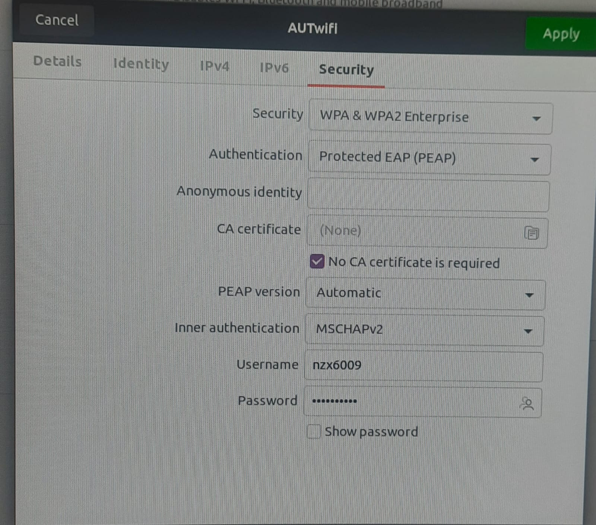

# Jetson

## WEBSITE:
https://www.jetson-ai-lab.com/  
**https://www.jetson-ai-lab.com/initial_setup_jon.html**  

## INTRODUCTION:

- Kit to start your journey of local generative AI evaluation and development  

### APPLICATIONS:
#### LLM (Large Language Models):
- Software that understands text and languages
- Generates human-like responses
- Examples: ChatGPT, Copilot, Gemini

#### VLM (Visual Language Models):
- Software that understands text and images
- Used for image captioning and text-to-image generation

#### ViTs (Vision Transformers):
- Image recognition neural networks
- Image classification and detection
- Used in self-driving cars and medical imaging

### STORAGE:
- NVMe SSD is used for the OS and data. **SDK Manager** is required to flash the latest JetPack on the NVMe SSD.
- If you have an x86 PC running Ubuntu 22.04 or 20.04, you can flash your Jetson Orin Nano Developer Kit with the latest firmware and JetPack using **NVIDIA SDK Manager**.


Since we have an NVMe SSD, we need **NVIDIA SDK Manager**.

[Watch Video](https://www.youtube.com/watch?v=FX2exKW_20E)

#### SSD (Solid State Drives):
- SDK MANAGER is required to boot JetPack
- Ubuntu 20.04 or 22.04 is required to use SDK Manager

#### SDK Manager Download:
- [YouTube Video](https://www.youtube.com/watch?v=BaRdpSXU6EM&t=418s) (22:52, 29:49)
- [SDK Manager Method](https://www.jetson-ai-lab.com/initial_setup_jon_sdkm.html#overall-flow-sdk-manager-method)

### JetsonZoo:
A collection of tutorials and links for downloading Python libraries.

### Advantages of SSD over microSD:
- Faster
- Larger capacity
- Cheaper
- More reliable


### Types of SSD:
1. **NVMe** - Supported
2. **SATA** - Not Supported


### SDK Manager:
NVIDIA SDK Manager is a one-stop solution that helps set up all the software required to work with NVIDIA hardware (Jetson Orin, GPUs, etc.).

Imagine you're building a gaming PC. Instead of searching for each driver, tool, or setting manually, you use a single program that installs everything in one go. That’s what the SDK Manager does for developers—it downloads, installs, and sets up the required software and tools automatically.

- Saves time
- Reduces errors
- Ensures proper configuration for development on NVIDIA platforms

### PACKING LIST:
- Jetson Orin NX core module
- Cooling fan
- Network card antenna
- Jetson Orin NX expansion board
- Power supply

## SETUP:

### CASING:
1. [Jetson Board Setup](https://www.youtube.com/watch?v=zxMn6U1DauE)
2. [Camera Setup](https://www.youtube.com/watch?v=fliiLNNoIWM)
3. [Antenna Setup](https://www.youtube.com/watch?v=tTHzI6u2lmE)

### CONNECTION STEPS:
1. Attach the antenna and camera.
2. Disconnect the HDMI cable from the CPU and connect it to the Jetson.
3. Disconnect the keyboard and mouse from the CPU and connect them to the Jetson.
5. Connect the power supply.
6. Connect to the wifi




7. Check Ubuntu version:  
```bash  
lsb_release -a  
```

#### JETPACK:

I was not able to install SDK manger on my device as the Jetson Orin NX is an ARM64 (aarch64) architecture device, while the SDK Manager package you downloaded is likely built for AMD64 (x86_64), which is meant for standard PCs. The SDK Manager cannot be installed directly on Jetson Orin NX because it is designed to run on a separate host PC (typically an Ubuntu x86_64 machine) for flashing and development.

I have directly installed Jetpack:

```bash  
sudo apt update
sudo apt upgrade -y
sudo apt install nvidia-jetpack
```
This will install:
  
1. CUDA
2. TensorRT
3. cuDNN
4. OpenCV
5. Multimedia API
6. VPI (Vision Programming Interface)

Verify the installation:
- Check if CUDA is installed properly:
```bash  
nvcc --version
```
- Check the installed JetPack version:
```bash  
dpkg -l | grep nvidia-jetpack
```

#### CAMERA

1. **Power Off the Jetson Device**
   - Before connecting the camera, make sure the Jetson device is powered off.

2. **Identify the CSI Port**
   - Locate the CSI (Camera Serial Interface) port on your Jetson device.
   - The CSI port is a small, thin slot labeled `CAM0` or `CAM1`.

3. **Insert the Golden Ribbon Cable**
   - Make sure the cable is in the correct orientation:
     - The **golden contacts** should face **down** (towards the board).
     - The **blue side** should face **up**.
   - Carefully insert one end of the ribbon cable into the CSI port on the Jetson.
   - Lock the connector by gently pressing down the black plastic clip.

4. **Connect the Camera Module**
   - Insert the other end of the golden ribbon cable into the camera module’s connector.
   - Ensure the golden contacts face **down** towards the circuit board.
   - Lock the connector by pressing the black clip.

5. **Power On the Jetson Device**
   - Once the camera is securely connected, turn on the Jetson device.

6. **Verify Camera Detection**
   - Open a terminal and run the following command:
     ```bash
     ls /dev/video*
     ```
     If the camera is detected, you should see a device like `/dev/video0`.

     
Code to start video:
```bash
git clone https://github.com/jetsonhacks/CSI-Camera
cd /CSI-Camera
python3 simple_camera.py

  ```


# PoseNet Installation on Jetson Nano (Micro USB Version)

## OS: JetPack 4.6

### 1. Enable Temperature Control (if a fan is connected)
```sh
sudo apt install python3-dev
git clone https://github.com/Pyrestone/jetson-fan-ctl.git
cd jetson-fan-ctl
./install.sh
```

### 2. Monitor Jetson Nano (RAM, CPU, GPU, and other parameters)
```sh
jtop
```
```sh
Output:


```

### 3. Install Required Dependencies
```sh
sudo apt-get install git cmake python3-dev libhdf5-serial-dev hdf5-tools libatlas-base-dev gfortran
```

### 4. Install Pip for Python 3
```sh
sudo apt install python3-pip
sudo -H pip3 install -U jetson-stats
```

### 5. Jetson Inference Setup
#### 5.1 Update System and Install Tools
```sh
sudo apt-get update
sudo apt-get install git cmake
```

#### 5.2 Clone the Repository
```sh
git clone https://github.com/dusty-nv/jetson-inference
cd jetson-inference
git submodule update --init
```

### 6. Install Additional Libraries
```sh
sudo apt-get install libpython3-dev python3-numpy
```

### 7. CMake Configuration
```sh
mkdir build
cd build
cmake ../
```

### 8. Download Models
```sh
cd jetson-inference/tools
./download-models.sh
```

### 9. Install PyTorch
#### 9.1 Execute Installation
```sh
cd jetson-inference/build
./install-pytorch.sh
```

#### 9.2 Verify Installation
```sh
make -j8
sudo make install
sudo ldconfig
```

### 10. Run a Model
```sh
cd /home/ialab/jetson-inference/build/aarch64/bin
python3 "model_name_to_run"
```

### 11. View Development Board Statistics
```sh
jtop
```

## Optional: Increase RAM via Swap
### 1. Disable `nvzramconfig`
```sh
sudo systemctl disable nvzramconfig
```

### 2. Create a 4GB Swap File
```sh
sudo fallocate -l 4g /mnt/4g.swap
sudo mkswap /mnt/4g.swap
sudo swapon /mnt/4g.swap
```

### 3. Make Swap Permanent
```sh
sudo gedit /etc/fstab
```
Add this line at the end of the file:
```
/mnt/4g.swap   none    swap    sw      0       0
```

## Check Camera Functionality
```sh
gst-launch-1.0 nvarguscamerasrc ! nvoverlaysink
```
Press `Ctrl + C` to close the window.


## REFERENCE:
- [Setup Guide](https://www.youtube.com/watch?v=-PjMC0gyH9s)  
- [Jetson AI Lab - Initial Setup](https://www.jetson-ai-lab.com/initial_setup_jon.html)  
- **[Yahboom Jetson Orin NX Study Guide](http://www.yahboom.net/study/Jetson-Orin-NX)**  
